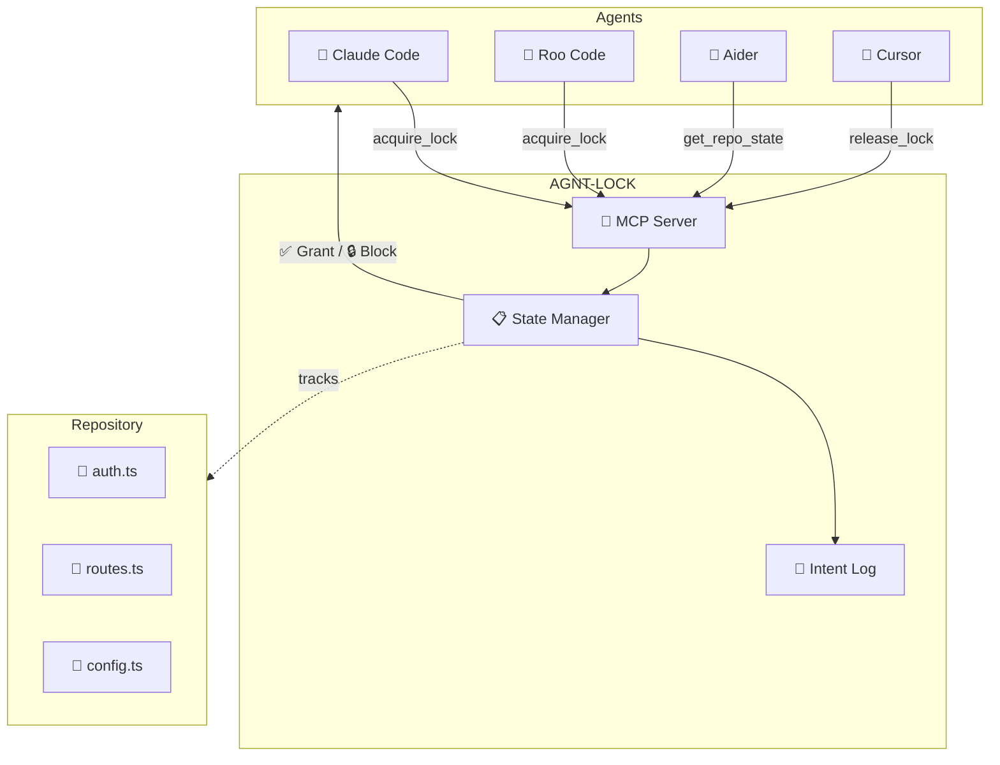

<div align="center">

  <h1><code> 🔐 AGNT-LOCK</code></h1>


### The Context Traffic Controller for Multi-Agent Repositories

**Stop AI agents from destroying each other's work.**

[](LICENSE)
[]()
[](https://modelcontextprotocol.io)
[](https://nodejs.org)
[](https://typescriptlang.org)


[Quick Start](#-quick-start) · [How It Works](#-how-it-works) · [MCP Config](#-mcp-configuration) · [CLI Usage](#-cli-usage) · [Contributing](#-contributing)

</div>

---

## 💥 The Problem: Agentic Collision

You're running **multiple AI agents** on the same codebase. Maybe Claude Code is refactoring your auth module while Aider is updating your API routes. Everything seems fine until:

```
┌─────────────────────────────────────────────────────────────────┐
│                                                                 │
│   🤖 Agent A (Claude Code)          🤖 Agent B (Aider)         │
│   ┌─────────────────────┐          ┌─────────────────────┐     │
│   │ Reading auth.ts...  │          │ Reading auth.ts...  │     │
│   │ Planning refactor   │          │ Planning new routes │     │
│   └────────┬────────────┘          └────────┬────────────┘     │
│            │                                │                   │
│            ▼                                ▼                   │
│   ┌─────────────────────┐          ┌─────────────────────┐     │
│   │ Writing auth.ts...  │          │ Writing auth.ts...  │     │
│   │ ✅ Refactor done!   │          │ ✅ Routes added!    │     │
│   └────────┬────────────┘          └────────┬────────────┘     │
│            │                                │                   │
│            └───────────┐  ┌─────────────────┘                   │
│                        ▼  ▼                                     │
│                 ┌──────────────┐                                │
│                 │  💀 auth.ts  │                                │
│                 │  CORRUPTED   │                                │
│                 │  Build: FAIL │                                │
│                 └──────────────┘                                │
│                                                                 │
│   Agent A's refactor is GONE. Agent B overwrote it.            │
│   Neither agent knows the other existed.                        │
│                                                                 │
└─────────────────────────────────────────────────────────────────┘
```

**This is "Agentic Collision"** — and it's the #1 reason multi-agent workflows fail silently.

### What goes wrong:
- 🔄 **Silent overwrites** — Agent B nukes Agent A's changes with zero warning
- 🧠 **Context loss** — Each agent hallucinates that it's the only one working
- 🔁 **Infinite loops** — Agents "fix" each other's changes back and forth forever
- 💀 **Broken builds** — The repo ends up in a state no single agent intended

---

## ✅ The Solution: AGNT-LOCK

AGNT-LOCK is a **lightweight coordination layer** that sits between your AI agents and your repository. It uses the **Model Context Protocol (MCP)** to give every agent awareness of what other agents are doing.



### How it works:

1. **Before editing**, an agent calls `acquire_lock(filepath, agent_name, intent)`
2. If the file is **free** → lock is granted, intent is logged
3. If the file is **locked by another agent** → request is **blocked** with details about who holds it and why
4. **After editing**, the agent calls `release_lock(filepath)` to free the file
5. Any agent can call `get_repo_state()` to see the full coordination map

---

## 🚀 Quick Start

### Install

```bash
# Clone the repository
git clone https://github.com/codewithriza/AGNT-LOCK.git
cd AGNT-LOCK

# Install dependencies
npm install

# Build
npm run build
```

### Run as MCP Server

```bash
# Start the MCP server (stdio transport)
node dist/index.js
```

### Install globally (CLI)

```bash
npm install -g .
agnt-lock status
```

---

## ⚙️ MCP Configuration

### For Claude Desktop / Claude Code

Add to your `claude_desktop_config.json`:

```json
{
  "mcpServers": {
    "agnt-lock": {
      "command": "node",
      "args": ["/absolute/path/to/AGNT-LOCK/dist/index.js"],
      "env": {}
    }
  }
}
```

### For Cursor

Add to your `.cursor/mcp.json`:

```json
{
  "mcpServers": {
    "agnt-lock": {
      "command": "node",
      "args": ["/absolute/path/to/AGNT-LOCK/dist/index.js"]
    }
  }
}
```

### For Roo Code (VS Code)

Add to your MCP settings in Roo Code:

```json
{
  "mcpServers": {
    "agnt-lock": {
      "command": "node",
      "args": ["/absolute/path/to/AGNT-LOCK/dist/index.js"],
      "disabled": false,
      "alwaysAllow": ["acquire_lock", "release_lock", "get_repo_state"]
    }
  }
}
```

> 💡 **Tip:** Replace `/absolute/path/to/AGNT-LOCK` with the actual path where you cloned the repo.

---

## 🛠️ MCP Tools

AGNT-LOCK exposes **4 tools** via the Model Context Protocol:

| Tool | Description |
|------|-------------|
| `acquire_lock` | Lock a file before editing. Blocks if already locked by another agent. |
| `release_lock` | Release a file lock after editing. Commits intent to session history. |
| `get_repo_state` | Get the full coordination map: active locks, agents, recent activity. |
| `force_release_all` | Emergency reset: force-release all locks in the repository. |

### acquire_lock

```typescript
// Parameters
{
  filepath: "src/auth.ts",        // File to lock
  agent_name: "claude-code",      // Who's locking it
  intent: "Refactoring auth middleware to use JWT"  // Why
}

// Response (success)
{
  "success": true,
  "message": "✅ Lock acquired on \"src/auth.ts\" by \"claude-code\".",
  "lock": {
    "filepath": "src/auth.ts",
    "agent_name": "claude-code",
    "intent": "Refactoring auth middleware to use JWT",
    "acquired_at": "2026-03-15T10:30:00.000Z",
    "expires_at": "2026-03-15T10:45:00.000Z"
  }
}

// Response (blocked)
{
  "success": false,
  "message": "🔒 BLOCKED: File \"src/auth.ts\" is locked by agent \"aider\"...",
  "blocked_by": { ... }
}
```

### get_repo_state

```
📊 AGNT-LOCK Repository State
━━━━━━━━━━━━━━━━━━━━━━━━━━━━━━
Session: session_20260315_a3f8k2
Active Locks: 2
Active Agents: claude-code, aider

🔒 Locked Files:
  • src/auth.ts → claude-code (intent: "Refactoring auth middleware")
  • src/routes.ts → aider (intent: "Adding new API endpoints")

📝 Recent Activity:
  🔐 claude-code → acquire "src/auth.ts"
  🔐 aider → acquire "src/routes.ts"
  🔓 roo-code → release "src/config.ts"
```

---

## 💻 CLI Usage

AGNT-LOCK also includes a CLI for manual coordination and debugging:

```bash
# Check repository coordination state
agnt-lock status

# Manually lock a file
agnt-lock lock src/index.ts my-agent "Updating the main entry point"

# Release a lock
agnt-lock unlock src/index.ts my-agent

# Emergency: release all locks
agnt-lock reset

# Start MCP server from CLI
agnt-lock serve
```

---

## 📁 Project Structure

```
AGNT-LOCK/
├── src/
│   ├── index.ts          # MCP server entry point (stdio transport)
│   ├── server.ts         # MCP tool definitions (acquire, release, state)
│   ├── state-manager.ts  # Core .agentlock state engine
│   └── cli.ts            # Color-coded CLI dashboard
├── tests/
│   └── state-manager.test.ts  # Vitest unit tests (9 tests)
├── website/              # Next.js + Tailwind landing page
│   ├── app/
│   │   ├── page.tsx      # Dark-mode landing page
│   │   ├── layout.tsx    # Root layout with metadata
│   │   └── globals.css   # Tailwind + custom styles
│   └── package.json
├── dist/                 # Compiled JavaScript (after build)
├── .agentlock/           # Runtime state directory (auto-created, gitignored)
│   └── state.json        # Current locks & intent log
├── vitest.config.ts      # Test configuration
├── package.json
├── tsconfig.json
├── LICENSE               # MIT
└── README.md
```

---

## 🔒 How the Lock System Works

```
┌──────────────────────────────────────────────────────────────┐
│                    .agentlock/state.json                      │
├──────────────────────────────────────────────────────────────┤
│                                                              │
│  active_locks: {                                             │
│    "src/auth.ts": {                                          │
│      agent_name: "claude-code",                              │
│      intent: "Refactoring auth middleware",                  │
│      acquired_at: "2026-03-15T10:30:00Z",                   │
│      expires_at: "2026-03-15T10:45:00Z"    ← Auto-expiry    │
│    }                                                         │
│  }                                                           │
│                                                              │
│  intent_log: [                                               │
│    { agent: "roo-code", action: "acquire", file: "..." },   │
│    { agent: "roo-code", action: "release", file: "..." },   │
│    { agent: "claude-code", action: "acquire", file: "..." } │
│  ]                          ↑ Rolling log (max 500 entries)  │
│                                                              │
└──────────────────────────────────────────────────────────────┘
```

### Key Design Decisions:

- **File-level locking** — Granular enough to allow parallel work, broad enough to prevent conflicts
- **15-minute TTL** — Locks auto-expire to prevent deadlocks from crashed agents
- **Intent logging** — Every lock/unlock is logged with *why* the agent needed the file
- **Zero external dependencies** — State is a single JSON file, no database required
- **Ownership verification** — Only the locking agent (or force-release) can unlock a file

---

## 🤝 Contributing

Contributions are welcome! Here's how to get started:

```bash
# Fork and clone
git clone https://github.com/YOUR_USERNAME/AGNT-LOCK.git
cd AGNT-LOCK

# Install dependencies
npm install

# Build
npm run build

# Test the CLI
node dist/cli.js status
```

### Ideas for contributions:
- 🌐 HTTP/SSE transport (for remote agent coordination)
- 📊 Web dashboard for visualizing lock state
- 🔔 Webhook notifications when locks are contested
- 🧪 Test suite
- 📦 npm package publishing
- 🐳 Docker container

---
